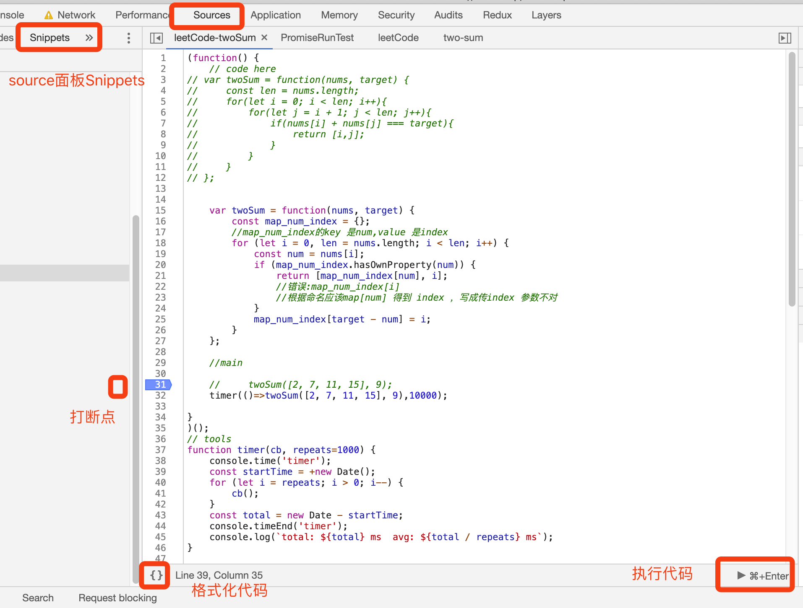

## 这是一个 小伙伴们一起刷leetcode 的故事


### 初衷
```
试试拿 github 作为一个讨论平台：
  1 能直接看代码
  2 可以发 pull request 来提意见，改代码，
  3 可以issure 里讨论有趣的问题

  4 以上记录了 学习过程的许多片段 ，回顾，分享，再加工/迭代 都是极好的
```

### 如何玩耍
- 加入：使用`github昵称`建立自己的文件夹
  - 新建笔记: 笔记名 
- leetCode 笔记
- 话题讨论，发issure

### miscellaneous
- 2种模式

|          | [探索模式](https://leetcode-cn.com/explore) | [题库模式](https://leetcode-cn.com/problemset/all/) |
| -------- | ------------------------------------------- | --------------------------- |
| url      | `exlore/...`                                | `problems/questionName`     |
| 功能场景 | 考试，题集                                  | 刷题，[笔记](https://support.leetcode-cn.com/hc/kb/article/1277857/)，支持搜索        |
|          |                                             |                             |
 

- js代码编写与调试 
  - 在chrome 的Source面板Snippers 里写代码并调试很顺手
     